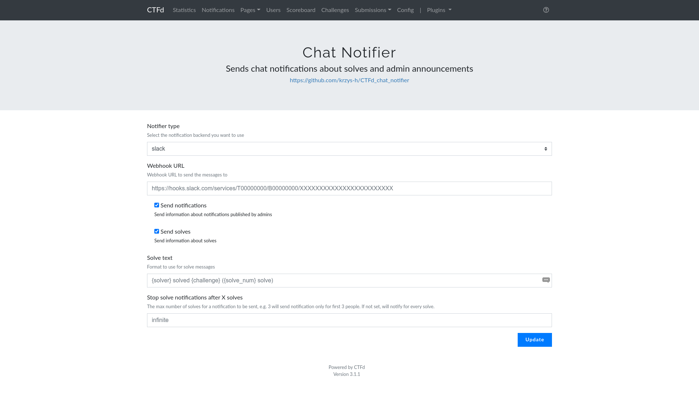

# CTFd Chat Notifier

A small CTFd plugin to send notifications to Slack, Discord or Telegram about solves and admin announcements. Can be easily extended to support other platforms.

## Installation

Clone this repo to `CTFd/plugins/CTFd_chat_notifier` in your CTFd installation directory and restart it. You should see the notifier settings in the admin panel.

Tested with CTFd 3.1.1.

## Extending

1. Create your own plugin (or, if you are implementing a popular service, modify this one and send me a pull request!)
2. Create a class that extends from `BaseNotifier`
3. If your notifier requires any configuration (it probably needs at least a webhook url), override the `get_settings` method and create a settings template in `templates/chat_notifier/admin_notifier_settings/your_notifier_type_id.html`. Override `is_configured` to return True only when all required settings are configured correctly.
4. Implement the `notify_solve` and `notify_message` methods
5. Register your notifier type by creating an instance of your class and adding it to the `NOTIFIER_CLASSES` dictionary
